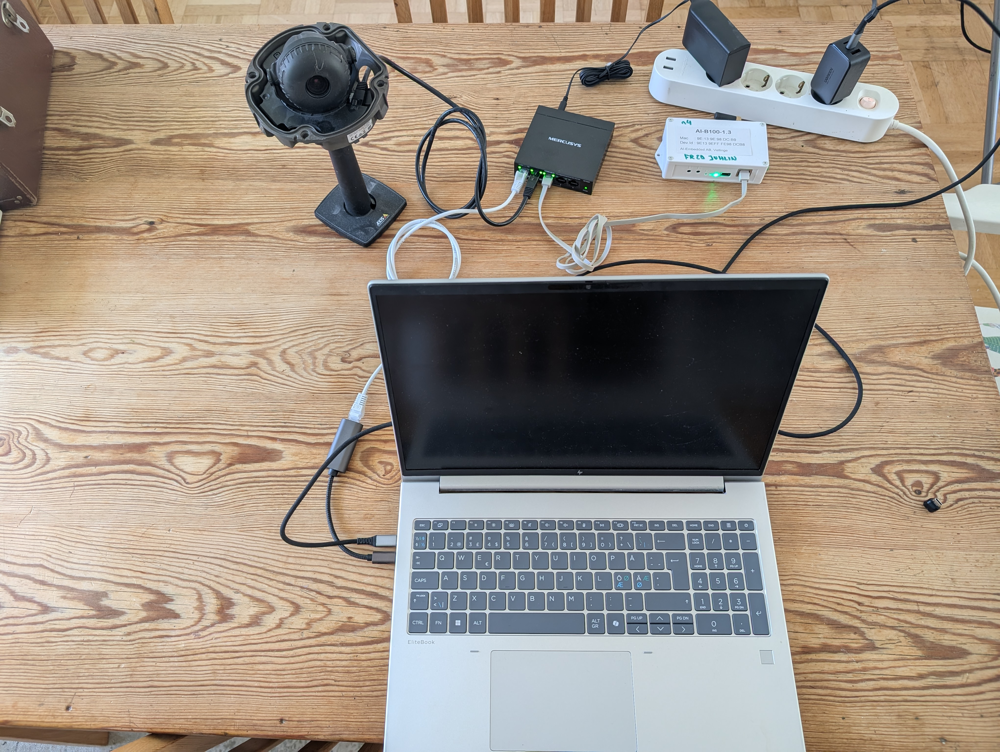
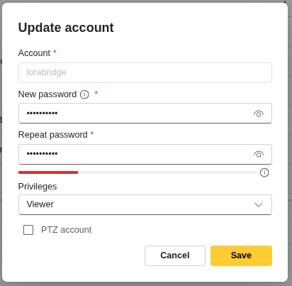
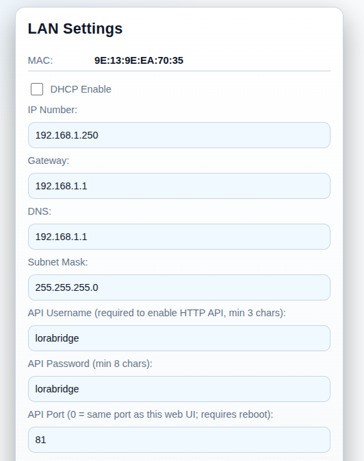
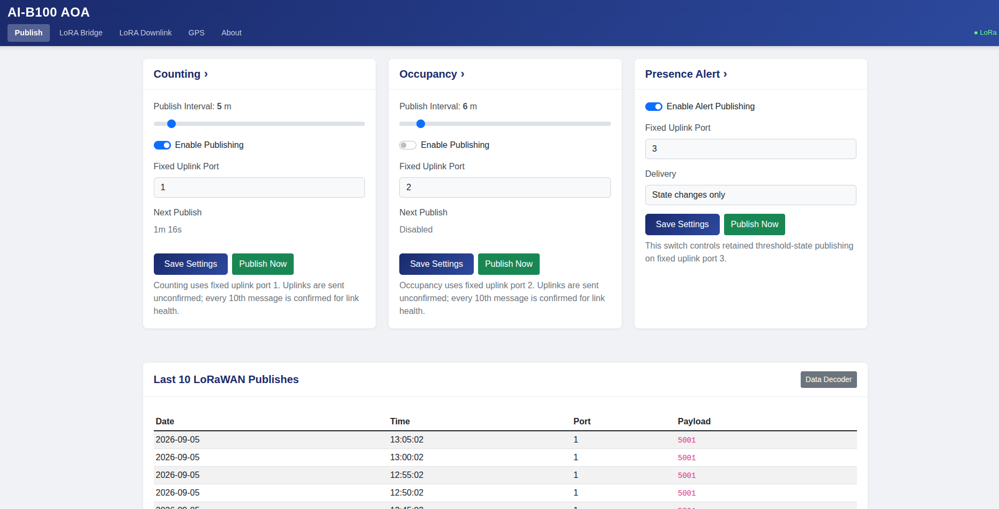

# Deployment Guide

Complete field deployment guide for AI-B100 Axis ACAP installations using an Axis camera or Axis radar camera, an AI-B100 LoRaWAN bridge, and PoE infrastructure.

---

## Required Hardware

| Component | Description | Example |
|-----------|-------------|---------|
| **Axis camera or radar camera** | Any model supporting the selected ACAP variant | AOA camera, radar-equipped camera, or ARTPEC-8/9 camera for DetectX |
| **AI-B100 LoRaWAN bridge** | PoE-powered Ethernet-to-LoRaWAN bridge | [AI-B100-POE](https://www.ai-embedded.se) |
| **PoE switch** | Unmanaged or managed; provides PoE to camera and bridge | Netgear GS305EPP |
| **Ethernet cables** | Cat5e or better | Short runs for cabinet/pole mounting |
| **Laptop** | For staging and on-site commissioning | Any laptop with Ethernet port or USB-Ethernet adapter |

---

## Wiring Diagram

```
                        ┌─────────────────┐
     Laptop ───────────►│   4 or 5-port   │◄─── (no uplink needed)
   (commissioning)      │   PoE Switch    │
                        └──┬──────────┬───┘
                           │ PoE      │ PoE
                           ▼          ▼
                    ┌──────────┐  ┌──────────────┐
                    │  Axis    │  │   AI-B100    │
                    │  Camera  │  │ Bridge (PoE) │
                    └──────────┘  └──────┬───────┘
                                         │ LoRa RF
                                         ▼
                                  LoRaWAN Gateway
```

Both the camera and the AI-B100 are powered directly via PoE from the switch — no splitter or external power supply needed.

---

## Mounting Recommendations

- **Camera:** Mount according to the selected analytics. For AOA line counting, 3–4 meters height with a 30–45° downward angle is a common starting point. For radar, follow the radar model's coverage and mounting recommendations.
- **AI-B100:** Mount with antenna pointing upward (vertical polarization). Avoid metal enclosures that block RF.
- **PoE switch:** If outdoors, use an IP65-rated enclosure with the switch inside.
- **Antenna placement:** Keep the AI-B100 antenna above obstructions. For pole mounts, place at the top of the pole if possible.

---

## IP Addressing

There is **no DHCP server** on the local network — all devices must use static IP addresses. Not all devices reliably support link-local (169.254.x.x) addressing, so always configure explicit static IPs.

**Use the same IP scheme at every installation.** Consistent addressing across all sites simplifies maintenance and troubleshooting when visiting different locations.

### Recommended Scheme

| Device | Static IP | Subnet Mask |
|--------|-----------|-------------|
| Laptop (commissioning example) | 192.168.1.10 | 255.255.255.0 |
| Axis camera or radar camera | 192.168.1.200 | 255.255.255.0 |
| AI-B100 bridge | 192.168.1.250 | 255.255.255.0 |

> **Note:** The camera and AI-B100 must be on the same subnet. No router, DHCP server, or internet connection is required at the site. The laptop is only needed during commissioning.

> **Tip:** Configure the camera with a fallback static IP (Axis cameras support this under **System → Network → IPv4 → Fallback address**). This ensures you can always reach the camera even if the primary address is misconfigured.

---

## Step-by-Step Deployment

> **Stage everything on the bench before going to the field.** Configure and verify all devices in the workshop first. On-site, connect a laptop to the switch to make final adjustments (camera aim, AOA line placement, signal verification).

A common staging setup with a laptop, camera, LoRA Bridge and PoE switch:



---

### Pre-Staging: Before Connecting Devices to PoE Switch

It is easier to configure static IP addresses while the camera and LoRA Bridge are connected to a LAN with DHCP. Perform the following pre-staging configuration before connecting everything to the isolated PoE switch.

These deployments normally use a small protected network containing only the PoE switch, camera or radar, bridge, and a commissioning laptop. Use the same service username and password for the bridge HTTP API and the camera callback account. This simplifies commissioning because the camera and bridge each use `lorabridge` / `lorabridge` when authenticating to the other device.

| Purpose | Device | Port | Username | Password |
| --- | --- | --- | --- | --- |
| Bridge web administration | AI-B100 | `80` | `admin` (fixed) | `lorabridge` |
| ACAP calls to bridge HTTP API | AI-B100 | `81` | `lorabridge` | `lorabridge` |
| Bridge callbacks to ACAP | Axis camera | `80` | `lorabridge` (Viewer) | `lorabridge` |

The bridge web account is separate because its username is fixed to `admin`. Different service credentials are supported; if you change them, use the same replacement values for the bridge API account, camera Viewer account, and corresponding ACAP fields, then record the site values securely.

---

### Step 1: Stage the Camera

1. Connect the camera to your local LAN and use a browser to access it. *Use AXIS IP Utility or similar tools to find its IP address.*
2. Install the ACAP variant that matches the device and use case:
   - `aoa/AI-B100_AOA_2_0_0_aarch64.eap` for AOA on ARTPEC-8 and ARTPEC-9 cameras
   - `aoa/AI-B100_AOA_2_0_0_armv7hf.eap` for AOA on ARTPEC-7 cameras
   - `radar/AI-B100_Radar_2_0_0_aarch64.eap` for Radar on ARTPEC-8 and ARTPEC-9 cameras
   - `radar/AI-B100_Radar_2_0_0_armv7hf.eap` for Radar on ARTPEC-7 cameras
   - `detectx/AI-B100_DetectX_2_0_0_aarch64.eap` for DetectX on ARTPEC-8 and ARTPEC-9 cameras
3. For AOA deployments, start **AXIS Object Analytics**. For Radar deployments, verify that radar analytics are available on the camera.
4. Go to **System → Accounts → Add Account**. The AI-B100 needs credentials to make HTTP callbacks to the camera.
   - Set username and password with **Viewer** privileges. If this password is compromised, the user can only view video.
   - Use the same service credentials that will be configured for the bridge HTTP API.
   - Recommended: user = `lorabridge`, password = `lorabridge`.

> **Important:** Document and save this username/password.



5. Set a static fallback IP address. Go to **System → Network**:
   - **Enable** "Fallback to static IP address"
   - **IP Address:** 192.168.1.200
   - **Subnet mask:** 255.255.255.0
   - **Router:** 192.168.1.1

> The camera can now be disconnected from LAN and connected to the PoE switch.

---

### Step 2: Stage the AI-B100 Bridge

*See the [AI-B100 User Manual](https://ai-embedded.se/ai-b100/) for detailed information.*

1. Connect the AI-B100 to your local LAN and use a browser to access it. *Use tools to find its IP address.*
2. Open the AI-B100 web UI at `http://<IP Address>` on port 80. On first boot, set the fixed `admin` account password to `lorabridge`.
3. Click **LAN Settings**:
   - **Disable DHCP**
   - **IP Number:** 192.168.1.250
   - **Gateway:** 192.168.1.1
   - **DNS:** 192.168.1.1
   - **Subnet Mask:** 255.255.255.0
   - **API Username:** `lorabridge`
   - **API Password:** `lorabridge`
   - **API Port:** `81`



4. Save the LAN settings and reboot after changing the API port. Continue using the web interface on port `80`; port `81` is for authenticated API calls from the ACAP.
5. Open the bridge HTTP API settings and configure callbacks. The ACAP will maintain these values after it connects:
   - **HTTP API Enable:** checked
   - **Callback IP:** 192.168.1.200 (the camera's IP address)
   - **Callback Port:** `80`
   - **Callback Status URI:** `/local/aib100/b100_status`
   - **Callback Receive URI:** `/local/aib100/b100_receive`
   - **Callback GPS URI:** `/local/aib100/b100_gps`
   - **Digest User:** `lorabridge` (the viewer account defined on the camera)
   - **Digest Password:** `lorabridge` (the account password defined on the camera)

6. Click **Save**.

> **Important:** The callback IP is the camera address, `192.168.1.200`, not the bridge address. The bridge uses these callback credentials when posting status, downlink, and GPS data to the camera.

> **Legacy bridge firmware:** AI-B100 firmware earlier than 2.0.0 uses the HTTP API on port 80 without API Digest authentication. Keep the ACAP Bridge API Port at `80` for those units. The ACAP preserves an existing saved port during upgrade and does not silently fall back from port 81.

> You can now connect the AI-B100 LoRA Bridge to the PoE switch as well as your laptop. Configure the laptop to use a free static address on the same subnet, for example **192.168.1.10**. Verify that your laptop can access the camera at `http://192.168.1.200` and the bridge at `http://192.168.1.250`. If you cannot connect, troubleshoot before proceeding.

---

### Step 3: LoRaWAN Configuration

*See the [AI-B100 User Manual](https://ai-embedded.se/ai-b100/) for detailed information.*

1. Browse to the bridge at `http://192.168.1.250`
2. Click **LoRaWAN Settings**:
   - **LoRaWAN Version:** Recommended to use "Version 1.04 Class C". This is a commonly supported setting. Class C enables the device to receive downlinks in real-time.
   - **Check "Auto Join"**
   - Leave other settings unchanged unless you are an experienced LoRaWAN user.
3. Use the **Join EUI**, **Device EUI**, and **App Key** to register the device in your LoRaWAN provider console.
4. Click **Submit**, then **Home**, then **Reboot**.

> You may not have LoRaWAN gateway coverage at the staging location and the join will fail. That is expected — it will join automatically once deployed in the field with gateway coverage.

---

### Step 4: Configure the ACAP

1. Use a browser to access the camera at `http://192.168.1.200` using your admin credentials.
2. Go to **Apps** and verify that the installed AI-B100 ACAP is running. For AOA deployments, also verify that **AXIS Object Analytics** is running.
3. Open the user interface for **AI-B100 AOA**, **AI-B100 Radar**, or **AI-B100 DetectX**.
4. Go to the **LoRA Bridge** tab:
   - **Bridge IP Address:** 192.168.1.250
   - **Bridge API Port:** 81
   - **Bridge API User:** `lorabridge`
   - **Bridge API Password:** `lorabridge`
   - **HTTP Callback Address:** 192.168.1.200
   - **HTTP Callback Port:** 80
   - **Callback User:** `lorabridge`
   - **Callback Password:** `lorabridge`
   - Click **Save Settings**. The ACAP then configures the bridge callbacks and requests bridge status.
5. Verify that the page shows **Bridge HTTP: Connected**, **Callbacks: Active**, and **HTTP API: Enabled**.

6. Configure the selected analytics use case:
   - For AOA, use **Counting**, **Occupancy**, and **Presence Alert** to select scenarios, classes, occupancy values, alert thresholds, and areas.
   - For Radar, use **Occupancy**, **Detection Alert**, **Speed**, and **Radar** to configure labels, publish behavior, speed measurement, areas of interest, and sensitivity. Counting remains reserved and is not an active deployment use case.
   - For DetectX, use **Occupancy** to draw the area of interest, select 1-5 labels in model order, and choose descriptive confidence and overlap-handling levels. The model is fixed when the ACAP is built and cannot be uploaded by an operator.

> AOA Counting totals persist across restarts. Their LoRaWAN values are 16-bit unsigned and wrap modulo 65536; other use cases have their own payload contracts.

7. Go to the **Publish** tab:
   - Enable the streams that should publish.
   - Set the publish intervals or heartbeat intervals.
   - Confirm the fixed LoRaWAN ports shown by the UI.
   - Click **Publish Now** to test an uplink.

For DetectX, port 2 contains exactly one occupancy byte per selected label. Download a new decoder after changing the selection because its byte-to-label mapping is part of the payload contract.



---

### Step 5: Set Up the LoRaWAN Subscriber

1. Connect to your LoRaWAN provider's MQTT broker. You will need the address, username, password, and topic where data is published.
2. On the ACAP **Publish** or **About** page, open or download the **Data Decoder** JavaScript for parsing binary uplinks. The **LoRA Downlink** page provides the OTA Encoder and OTA Decoder where supported.

---

### Step 6: Verify End-to-End

1. Walk in front of the camera, drive a vehicle through the counting zone, or trigger the configured radar area.
2. Observe the values changing in the ACAP UI while the laptop is still connected.
3. Wait for the next scheduled transmission (or click **Publish Now**).
4. Confirm the decoded payload appears on your network server / application.
5. Disconnect the laptop — deployment is complete.

---

## Shared Bridge Configuration Reference

The following settings are common to fresh AOA, Radar, and DetectX 2.0.0 installations. LoRaWAN use-case ports and transmission objects differ by variant and are documented in each app's README.

```json
{
   "b100": {
      "ip": "192.168.1.250",
      "port": 81,
      "timeout": 30,
      "apiDigestUser": "lorabridge",
      "apiDigestPassword": "lorabridge",
      "callbackIP": "192.168.1.200",
      "callbackPort": 80,
      "callbackDigestUser": "lorabridge",
      "callbackDigestPassword": "lorabridge"
   },
   "polling": {
      "healthCheckIntervalSeconds": 60
   }
}
```

### Settings Explained

| Setting | Description | Recommendation |
|---------|-------------|----------------|
| `b100.ip` | AI-B100 bridge IP address | `192.168.1.250` (same subnet as camera) |
| `b100.port` | Authenticated bridge HTTP API port | `81` for bridge firmware 2.0.0 and later; `80` for legacy firmware |
| `b100.apiDigestUser` / `apiDigestPassword` | Credentials used by the ACAP when calling the bridge API | Same `lorabridge` / `lorabridge` service credentials used for callbacks |
| `b100.callbackIP` | Camera callback address used by the bridge | `192.168.1.200` |
| `b100.callbackPort` | Camera HTTP port used for bridge callbacks | `80` |
| `b100.callbackDigestUser` / `callbackDigestPassword` | Axis Viewer credentials used by the bridge when calling the ACAP | Same `lorabridge` / `lorabridge` service credentials used for the bridge API |
| `b100.timeout` | HTTP timeout in seconds | 30s (device can be slow) |
| `lorawan.port` | Legacy/default LoRaWAN uplink port metadata | Fixed app ports are shown by the UI |
| `lorawan.confirmed` | Request downlink ACK for uplinks | `false` (saves airtime) |
| `lorawan.dataRate` | Fixed data rate (0–5) | 4 or 5 for short range; 0–2 for long range |
| `lorawan.autoJoin` | Auto-rejoin if connection lost | `true` |
| `transmission.*.intervalMinutes` | Minutes between scheduled uplinks | 10–15 (duty cycle safe) |
| `polling.healthCheckIntervalSeconds` | Bridge health check interval | 60 |

---

## LoRaWAN Best Practices

### Duty Cycle

LoRaWAN EU868 imposes a **1% duty cycle** on most sub-bands. At DR5 (SF7), a typical counter payload (~30 bytes) takes about 50ms of airtime. With a 15-minute interval, you use far less than 1% — leaving headroom for retransmissions.

**Minimum recommended interval: 10 minutes.**

### Data Rate Selection

| Situation | Recommended DR | Range |
|-----------|---------------|-------|
| Gateway < 500m, good line of sight | DR5 (SF7) | ~2 km |
| Gateway 500m–2km, urban | DR3–DR4 (SF9–SF8) | ~5 km |
| Gateway > 2km, rural or obstructed | DR0–DR2 (SF12–SF10) | ~10+ km |

> **Tip:** Enable ADR (Adaptive Data Rate) and let the network optimize. Only set a fixed DR if you know the deployment conditions won't change.

### Signal Quality Thresholds

| Metric | Good | Marginal | Poor |
|--------|------|----------|------|
| RSSI | > −100 dBm | −100 to −115 dBm | < −115 dBm |
| SNR | > 5 dB | 0 to 5 dB | < 0 dB |

Check these on the ACAP's **LoRA Bridge** page after joining. If signal is marginal:
- Try repositioning the AI-B100 antenna higher
- Use an AI-B100-ANT variant with an external antenna
- Lower the data rate for more link budget

### Class C Considerations

The AI-B100 operates in **Class C** (continuous receive). This means:
- Downlink commands are received within seconds at any time
- The device draws more power than Class A (not relevant for PoE-powered setups)
- No need to schedule downlinks around uplinks

---

## Troubleshooting

### Bridge not connecting

| Symptom | Check |
|---------|-------|
| "Not Connected" on Bridge page | Verify AI-B100 IP `192.168.1.250`, API port `81`, and Bridge API User/Password |
| HTTP 401 or authentication failure | Ensure the bridge API account and ACAP Bridge API credentials are identical |
| Callbacks are not active | Ensure Callback User/Password match the camera Viewer account and callback address is `192.168.1.200:80` |
| Connection timeout | Ensure camera and AI-B100 are on the same subnet (`192.168.1.x/24`) |
| Intermittent disconnects | Check PoE switch — ensure it delivers sufficient PoE wattage to both devices |

### LoRaWAN not joining

| Symptom | Check |
|---------|-------|
| "Trying to join" for > 2 minutes | Verify keys match between AI-B100 and network server |
| Status code 4 (Could not join) | Check gateway coverage; try DR0 for join (maximum range) |
| Joins but shows "Not Joined" later | Enable `autoJoin`; check if gateway went offline |

### Counters not incrementing

| Symptom | Check |
|---------|-------|
| AOA counters stay at zero | Verify AOA scenarios are active and detecting objects |
| AOA page shows "No scenarios" | Ensure AOA CrosslineCounting is configured (not just ObjectDetection) |
| Radar values stay at zero | Verify radar analytics are active, sensitivity is appropriate, and the selected label/area matches the test target |
| Values change but don't publish | Check that the relevant stream is enabled and the interval has elapsed |

### Uplinks not received by network server

| Symptom | Check |
|---------|-------|
| fcntUp increments but no data on server | Check gateway connectivity; verify device is registered |
| Payload appears garbled | Ensure the correct payload decoder is applied |
| "Queue full" errors in bridge status | Reduce transmission frequency; the AI-B100 can queue ~5 messages |

---

## Maintenance

### Remote Management via Downlink

Once deployed, supported settings and actions can be managed through LoRaWAN downlinks. The available actions and configuration services differ by ACAP variant, so use the generated **OTA Encoder** and **OTA Decoder** from the LoRA Downlink page instead of constructing raw command bytes by hand.

- [AOA encoder and decoder guide](aoa/decoder/README.md)
- [Radar encoder and decoder guide](radar/decoder/README.md)
- DetectX embeds its current label mapping in the generated OTA JavaScript available from its backend endpoints.

### Firmware Updates

- **ACAP update:** Upload a new `.eap` via the camera web UI (requires network access to camera)
- **AI-B100 firmware:** Updated via the AI-B100 web UI (requires network access to bridge)
- **Camera firmware:** Standard Axis firmware update procedure

### State Persistence

Counters and retained use-case state survive:
- ACAP restarts
- Camera reboots
- Power cycles

State is reset only by:
- Downlink command (port 100, `0x03`)
- Manual reset via the ACAP web UI

---

## Security Considerations

- The camera and AI-B100 communicate over an isolated LAN — no internet exposure
- Bridge API and callback requests use HTTP Digest authentication in firmware/application 2.0.0; HTTP itself is not encrypted, so keep this network isolated and trusted
- The recommended shared `lorabridge` service credentials simplify managed installations; use unique strong site credentials where the local network is not physically protected
- LoRaWAN payloads are encrypted (AES-128) between the device and network server
- Only numeric counters are transmitted — no images or video leave the site
- The ACAP web UI is protected by the camera's existing authentication
- Downlink commands are authenticated by the LoRaWAN network key infrastructure

---

## Contact

- **AI-B100 hardware:** [AI Embedded Nordic AB](https://www.ai-embedded.se) — ai-b100@ai-embedded.se
- **Axis cameras:** [Axis Communications](https://www.axis.com)
