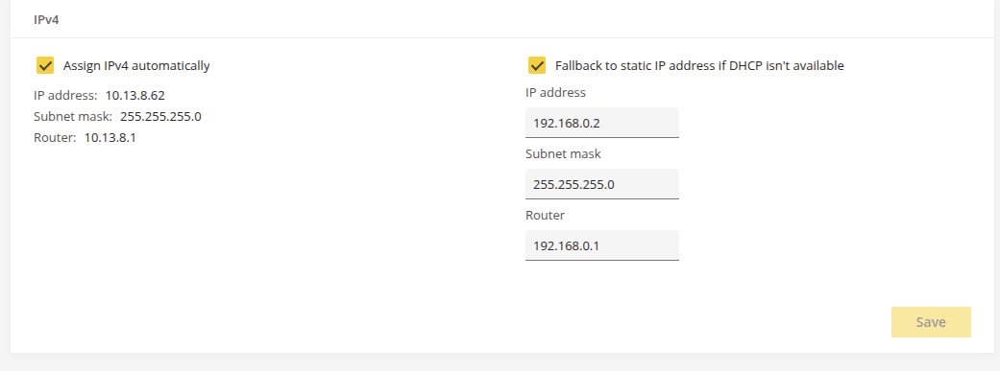
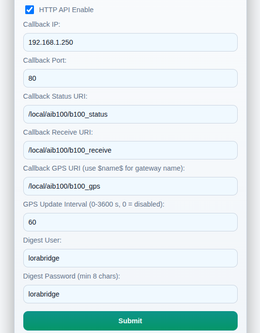
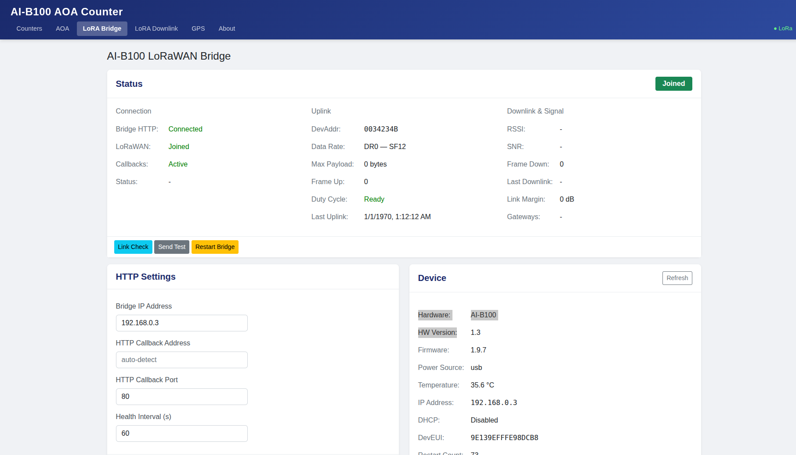
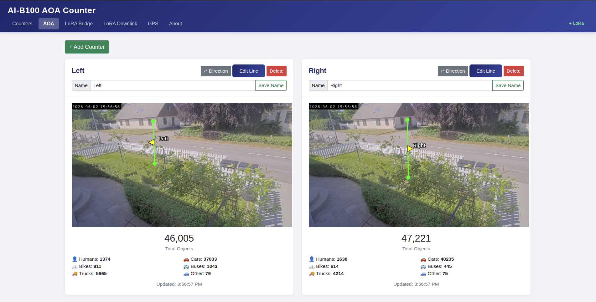
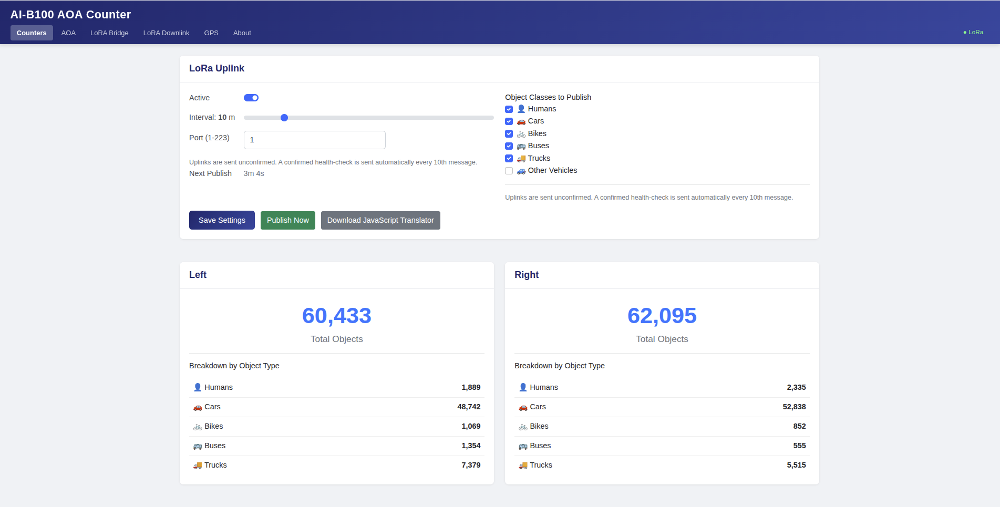

# Deployment Guide

Complete field deployment guide for the AI-B100 AOA Counter system using an Axis camera, AI-B100 LoRaWAN bridge, and PoE infrastructure.

---

## Required Hardware

| Component | Description | Example |
|-----------|-------------|---------|
| **Axis camera** | Any model supporting ACAP v4+ and Axis Object Analytics | M3086-V, P3245-V, Q1656 |
| **AI-B100 LoRaWAN bridge** | PoE-powered Ethernet-to-LoRaWAN bridge | [AI-B100-POE](https://www.ai-embedded.se) |
| **PoE switch** | Unmanaged or managed; provides PoE to camera and bridge | Netgear GS305EPP |
| **Ethernet cables** | Cat5e or better | Short runs for cabinet/pole mounting |
| **Laptop** | For staging and on-site commissioning | Any laptop with Ethernet port or USB-Ethernet adapter |

---

## Wiring Diagram

```
                        ┌─────────────────┐
     Laptop ───────────►│   4 or 5-port   │◄─── (no uplink needed)
   (commissioning)      │   PoE Switch    │
                        └──┬──────────┬───┘
                           │ PoE      │ PoE
                           ▼          ▼
                    ┌──────────┐  ┌──────────────┐
                    │  Axis    │  │   AI-B100    │
                    │  Camera  │  │ Bridge (PoE) │
                    └──────────┘  └──────┬───────┘
                                         │ LoRa RF
                                         ▼
                                  LoRaWAN Gateway
```

Both the camera and the AI-B100 are powered directly via PoE from the switch — no splitter or external power supply needed.

---

## Mounting Recommendations

- **Camera:** Mount at 3–4 meters height for optimal AOA people/vehicle detection. Angle 30–45° downward.
- **AI-B100:** Mount with antenna pointing upward (vertical polarization). Avoid metal enclosures that block RF.
- **PoE switch:** If outdoors, use an IP65-rated enclosure with the switch inside.
- **Antenna placement:** Keep the AI-B100 antenna above obstructions. For pole mounts, place at the top of the pole if possible.

---

## IP Addressing

There is **no DHCP server** on the local network — all devices must use static IP addresses. Not all devices reliably support link-local (169.254.x.x) addressing, so always configure explicit static IPs.

**Use the same IP scheme at every installation.** Consistent addressing across all sites simplifies maintenance and troubleshooting when visiting different locations.

### Recommended Scheme

| Device | Static IP | Subnet Mask |
|--------|-----------|-------------|
| Laptop (commissioning) | 192.168.0.1 | 255.255.255.0 |
| Axis camera | 192.168.0.2 | 255.255.255.0 |
| AI-B100 bridge | 192.168.0.3 | 255.255.255.0 |

> **Note:** The camera and AI-B100 must be on the same subnet. No router, DHCP server, or internet connection is required at the site. The laptop is only needed during commissioning.

> **Tip:** Configure the camera with a fallback static IP (Axis cameras support this under **System → Network → IPv4 → Fallback address**). This ensures you can always reach the camera even if the primary address is misconfigured.

---

## Step-by-Step Deployment

> **Stage everything on the bench before going to the field.** Configure and verify all devices in the workshop first. On-site, connect a laptop to the switch to make final adjustments (camera aim, AOA line placement, signal verification).

A common staging setup with a laptop, camera, LoRA Bridge and PoE switch:


---

### Pre-Staging: Before Connecting Devices to PoE Switch

It is easier to configure static IP addresses while the camera and LoRA Bridge are connected to a LAN with DHCP. Perform the following pre-staging configuration before connecting everything to the isolated PoE switch.

---

### Step 1: Stage the Camera

1. Connect the camera to your local LAN and use a browser to access it. *Use AXIS IP Utility or similar tools to find its IP address.*
2. Install the ACAP:
   - [AI-B100_AOA_Counter_1_x_x_aarch64.eap](https://raw.githubusercontent.com/pandosme/AI-B100/main/aoa/AI-B100_AOA_Counter_1_0_1_aarch64.eap) for ARTPEC-8 and ARTPEC-9 cameras
   - [AI-B100_AOA_Counter_1_x_x_armv7hf.eap](https://raw.githubusercontent.com/pandosme/AI-B100/main/aoa/AI-B100_AOA_Counter_1_0_1_armv7hf.eap) for ARTPEC-7 cameras
3. Start **AXIS Object Analytics**.
4. Go to **System → Accounts → Add Account**. The AI-B100 needs credentials to make HTTP callbacks to the camera.
   - Set username and password with **Viewer** privileges. If this password is compromised, the user can only view video.
   - Example: user = `aib100`, password = `aib100`

> **Important:** Document and save this username/password.


5. Set a static fallback IP address. Go to **System → Network**:
   - **Enable** "Fallback to static IP address"
   - **IP Address:** 192.168.0.2
   - **Subnet mask:** 255.255.255.0
   - **Router:** 192.168.0.1



> The camera can now be disconnected from LAN and connected to the PoE switch.

---

### Step 2: Stage the AI-B100 Bridge

*See the [AI-B100 User Manual](https://ai-embedded.se/ai-b100/) for detailed information.*

1. Connect the AI-B100 to your local LAN and use a browser to access it. *Use tools to find its IP address.*
2. Open the AI-B100 web UI at `http://<IP Address>`
3. Click **LAN Settings**:
   - **Disable DHCP**
   - **IP Number:** 192.168.0.3
   - **Gateway:** 192.168.0.1
   - **DNS:** 192.168.0.1
   - **Subnet Mask:** 255.255.255.0


4. Enable HTTP callbacks. Note that the ACAP will update some of these settings; you need to set:
   - **Check "HTTP API Enabled"**
   - **Callback IP:** 192.168.0.2 (the camera's IP address)
   - **Digest User:** `aib100` (the account defined on the camera)
   - **Digest Password:** `aib100` (the account password defined on the camera)



5. Click **Save**.

> You can now connect the AI-B100 LoRA Bridge to the PoE switch as well as your laptop. Note that you must configure the laptop to use static IP address **192.168.0.1**. Verify that your laptop can access the camera at `http://192.168.0.2` and the bridge at `http://192.168.0.3`. If you cannot connect, troubleshoot before proceeding.

---

### Step 3: LoRaWAN Configuration

*See the [AI-B100 User Manual](https://ai-embedded.se/ai-b100/) for detailed information.*

1. Browse to the bridge at `http://192.168.0.3`
2. Click **LoRaWAN Settings**:
   - **LoRaWAN Version:** Recommended to use "Version 1.04 Class C". This is a commonly supported setting. Class C enables the device to receive downlinks in real-time.
   - **Check "Auto Join"**
   - Leave other settings unchanged unless you are an experienced LoRaWAN user.
3. Use the **Join EUI**, **Device EUI**, and **App Key** to register the device in your LoRaWAN provider console.
4. Click **Submit**, then **Home**, then **Reboot**.

> You may not have LoRaWAN gateway coverage at the staging location and the join will fail. That is expected — it will join automatically once deployed in the field with gateway coverage.

---

### Step 4: Configure the ACAP

1. Use a browser to access the camera at `http://192.168.0.2` using your admin credentials.
2. Go to **Apps** and verify that both **AI-B100 AOA Counter** and **AXIS Object Analytics** are running.
3. Open the user interface for **AI-B100 AOA Counter**.
4. Go to the **LoRA Bridge** tab:
   - **Bridge IP Address:** 192.168.0.3
   - **HTTP Callback:** Auto-configure
   - **HTTP Callback Port:** 80
   - Click **Save**.
5. If the bridge is connected, the status will be shown on the page.



6. Go to the **AOA** tab to set up counters. Click **+Add counter**. A common configuration is two counters: Left and Right.



> The ACAP saves counters periodically and resumes the values after reboot. Note that the values published over LoRaWAN are 16-bit unsigned and will wrap around at 65535.

7. Go to the **Counters** tab:
   - **Active:** true
   - **Interval:** 1–60 minutes
   - **Port:** 1–223 (typically port 1 for the main data)
   - **Object Classes to Publish:** Select the classes/labels to count



---

### Step 5: Set Up the LoRaWAN Subscriber

1. Connect to your LoRaWAN provider's MQTT broker. You will need the address, username, password, and topic where data is published.
2. On the ACAP **About** page, click **Download JavaScript Translator** to get the JavaScript code for parsing the binary payload published over LoRaWAN.

---

### Step 6: Verify End-to-End

1. Walk in front of the camera or drive a vehicle through the counting zone.
2. Observe the counter incrementing on the ACAP Counters page (laptop still connected).
3. Wait for the next scheduled transmission (or click **Publish Now**).
4. Confirm the decoded payload appears on your network server / application.
5. Disconnect the laptop — deployment is complete.

---

## Configuration Reference

```json
{
  "b100": {
    "ip": "192.168.0.3",
    "port": 80,
    "timeout": 30
  },
  "lorawan": {
    "port": 10,
    "confirmed": false,
    "dataRate": 4,
    "autoJoin": true
  },
  "transmission": {
    "intervalMinutes": 15,
    "enabled": true,
    "classes": {
      "human": true, "car": true, "bike": true,
      "bus": true, "truck": true, "other": true
    }
  },
  "polling": {
    "downlinkIntervalSeconds": 30,
    "healthCheckIntervalSeconds": 60
  }
}
```

### Settings Explained

| Setting | Description | Recommendation |
|---------|-------------|----------------|
| `b100.ip` | AI-B100 bridge IP address | `192.168.0.3` (same subnet as camera) |
| `b100.timeout` | HTTP timeout in seconds | 30s (device can be slow) |
| `lorawan.port` | LoRaWAN uplink port number | 10 (match your decoder) |
| `lorawan.confirmed` | Request downlink ACK for uplinks | `false` (saves airtime) |
| `lorawan.dataRate` | Fixed data rate (0–5) | 4 or 5 for short range; 0–2 for long range |
| `lorawan.autoJoin` | Auto-rejoin if connection lost | `true` |
| `transmission.intervalMinutes` | Minutes between uplinks | 10–15 (duty cycle safe) |
| `polling.downlinkIntervalSeconds` | How often to check for downlinks | 30 |
| `polling.healthCheckIntervalSeconds` | Bridge health check interval | 60 |

---

## LoRaWAN Best Practices

### Duty Cycle

LoRaWAN EU868 imposes a **1% duty cycle** on most sub-bands. At DR5 (SF7), a typical counter payload (~30 bytes) takes about 50ms of airtime. With a 15-minute interval, you use far less than 1% — leaving headroom for retransmissions.

**Minimum recommended interval: 10 minutes.**

### Data Rate Selection

| Situation | Recommended DR | Range |
|-----------|---------------|-------|
| Gateway < 500m, good line of sight | DR5 (SF7) | ~2 km |
| Gateway 500m–2km, urban | DR3–DR4 (SF9–SF8) | ~5 km |
| Gateway > 2km, rural or obstructed | DR0–DR2 (SF12–SF10) | ~10+ km |

> **Tip:** Enable ADR (Adaptive Data Rate) and let the network optimize. Only set a fixed DR if you know the deployment conditions won't change.

### Signal Quality Thresholds

| Metric | Good | Marginal | Poor |
|--------|------|----------|------|
| RSSI | > −100 dBm | −100 to −115 dBm | < −115 dBm |
| SNR | > 5 dB | 0 to 5 dB | < 0 dB |

Check these on the ACAP's **LoRA Bridge** page after joining. If signal is marginal:
- Try repositioning the AI-B100 antenna higher
- Use an AI-B100-ANT variant with an external antenna
- Lower the data rate for more link budget

### Class C Considerations

The AI-B100 operates in **Class C** (continuous receive). This means:
- Downlink commands are received within seconds at any time
- The device draws more power than Class A (not relevant for PoE-powered setups)
- No need to schedule downlinks around uplinks

---

## Troubleshooting

### Bridge not connecting

| Symptom | Check |
|---------|-------|
| "Not Connected" on Bridge page | Verify AI-B100 IP is `192.168.0.3` and reachable (connect laptop and ping) |
| Connection timeout | Ensure camera and AI-B100 are on the same subnet (192.168.0.x/24) |
| Intermittent disconnects | Check PoE switch — ensure it delivers sufficient PoE wattage to both devices |

### LoRaWAN not joining

| Symptom | Check |
|---------|-------|
| "Trying to join" for > 2 minutes | Verify keys match between AI-B100 and network server |
| Status code 4 (Could not join) | Check gateway coverage; try DR0 for join (maximum range) |
| Joins but shows "Not Joined" later | Enable `autoJoin`; check if gateway went offline |

### Counters not incrementing

| Symptom | Check |
|---------|-------|
| Counters stay at zero | Verify AOA scenarios are active and detecting objects |
| AOA page shows "No scenarios" | Ensure AOA CrosslineCounting is configured (not just ObjectDetection) |
| Counters increment but don't publish | Check that transmission is enabled and interval has elapsed |

### Uplinks not received by network server

| Symptom | Check |
|---------|-------|
| fcntUp increments but no data on server | Check gateway connectivity; verify device is registered |
| Payload appears garbled | Ensure the correct payload decoder is applied |
| "Queue full" errors in bridge status | Reduce transmission frequency; the AI-B100 can queue ~5 messages |

---

## Maintenance

### Remote Management via Downlink

Once deployed, the system can be managed entirely via LoRaWAN downlinks:
- Change transmission interval (port 11, command 0x01)
- Reset counters (port 10, command 0x03)
- Request device info (port 12)
- Restart bridge (port 10, command 0x01)

### Firmware Updates

- **ACAP update:** Upload a new `.eap` via the camera web UI (requires network access to camera)
- **AI-B100 firmware:** Updated via the AI-B100 web UI (requires network access to bridge)
- **Camera firmware:** Standard Axis firmware update procedure

### Counter Persistence

Counters survive:
- ACAP restarts
- Camera reboots
- Power cycles

Counters are reset to zero only by:
- Downlink command (port 10, 0x03)
- Manual reset via the ACAP web UI

---

## Security Considerations

- The camera and AI-B100 communicate over an isolated LAN — no internet exposure
- LoRaWAN payloads are encrypted (AES-128) between the device and network server
- Only numeric counters are transmitted — no images or video leave the site
- The ACAP web UI is protected by the camera's existing authentication
- Downlink commands are authenticated by the LoRaWAN network key infrastructure

---

## Contact

- **AI-B100 hardware:** [AI Embedded Nordic AB](https://www.ai-embedded.se) — ai-b100@ai-embedded.se
- **Axis cameras:** [Axis Communications](https://www.axis.com)
