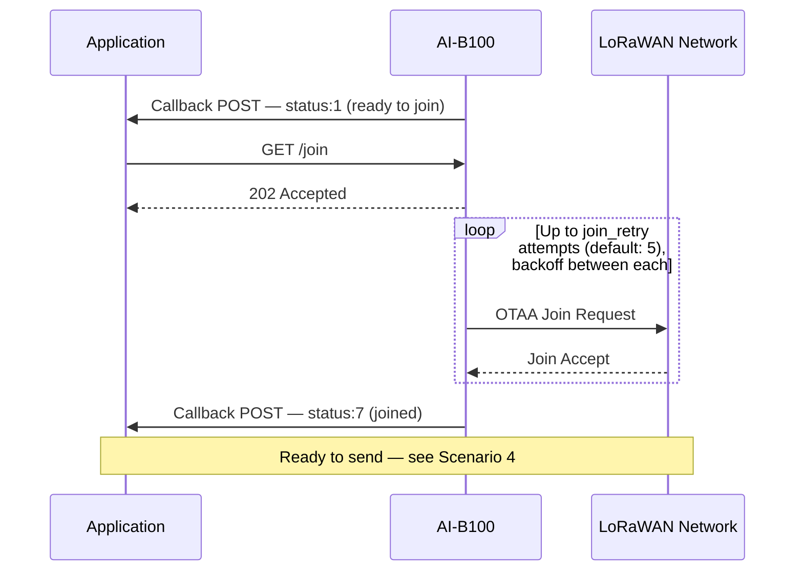
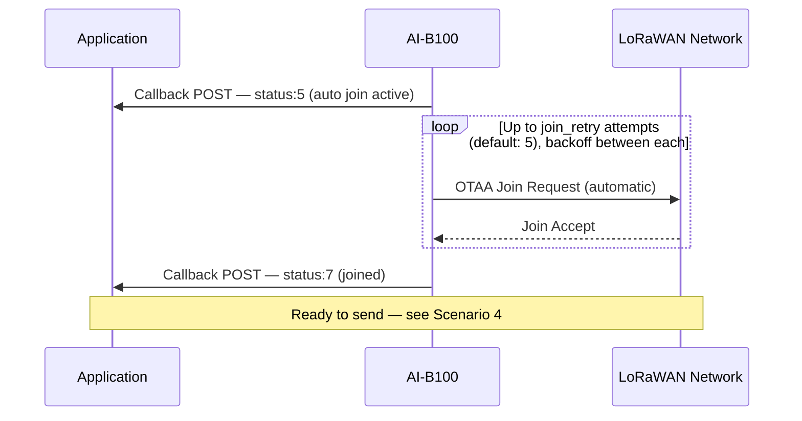
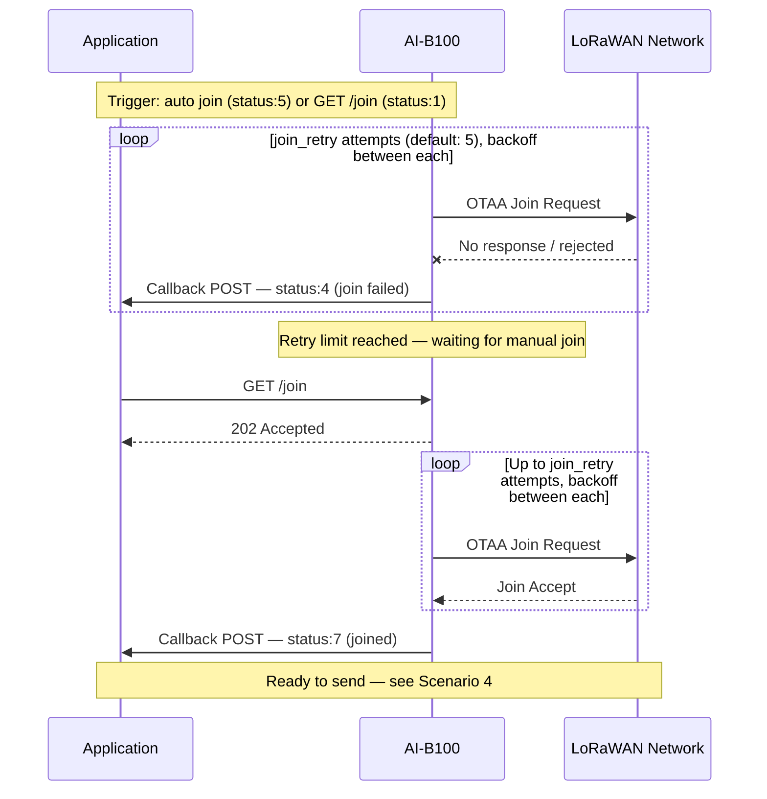
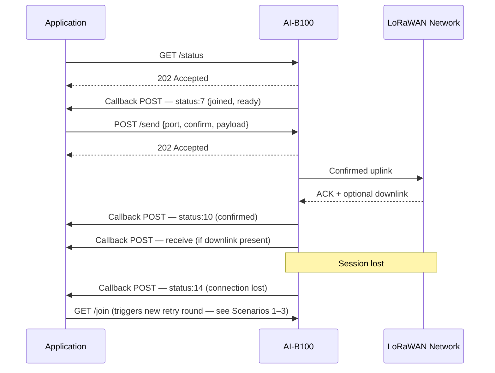

# HTTP API

## Revision History

| Software Version | Change |
|---|---|
| 1.9.0 | Parameter renames, callbacks introduced.  |
| 1.9.2 | Added `name` parameter (gateway name, max 16 chars). Added `$name$` tag support in `callback_status_uri` and `callback_receive_uri` |
| 1.9.3 | Added Join retry counter to auto join and manual join. Added Digest Authentication support for outbound callbacks (`callback_auth_user`, `callback_auth_password`) |
| 1.9.5 | Added GPS support: new `/gps` endpoint, `gps_status` and `tamper` in `/info`, GPS callback (`callback_gps_uri`, `gps_update_interval`), MQTT GPS (`gps_topic`, `mqtt_gps_interval`), `tamper_port` LoRaWAN parameter. `$name$` tag extended to `callback_gps_uri` and all MQTT topics. Parameter renames: `callback_auth_user` → `callback_digest_user`, `callback_auth_password` → `callback_digest_password`, `broker_host` → `broker_addr`. |


## API Endpoints

The following section lists the valid API endpoints on the device.

The HTTP API is only active when the HTTP API checkbox in LAN settings is enabled.
The HTML settings pages are always available.

Because LoRaWAN operations take measurable time, `status`, `join`, `send` and `linkcheck` results are returned through callbacks.

The AI-B100 uses a single communication socket. Each API request must complete before another request is initiated. This also applies to the web-based configuration pages.

JSON keys and parameter names in this document are shown exactly as implemented and are case-sensitive. The tables "Valid parameters" and "JSON Members" list all valid names.

For POST requests with a JSON body, use `Content-Type: application/json` and include a valid `Content-Length` header.


## Interaction Scenarios

All operational commands (`/join`, `/send`, `/linkcheck`, `/status`) require callbacks to be configured.
Results are never returned in the HTTP response itself — they always arrive as a POST to the configured callback URL.

The four scenarios below describe the typical lifecycle. Each assumes callbacks are already configured.
See [Setting up Callback and enable API](#setting-up-callback-and-enable-api) if they are not yet set up.

---

### Scenario 1: Gateway starts without auto join

The gateway waits for an explicit join command. Use this when the application controls when joining happens.

**Prerequisite:** `autojoin = 0`



**Step 1 — Gateway powers up.**
The callback server receives a status callback:

```http
POST /status HTTP/1.1
Host: 192.168.1.180:1832
Content-Type: application/json
Content-Length: 96

{
    "status": 1,
    "dev_addr": "0",
    "confirmed": 0,
    "fcntUp": 0,
    "data_rate": 3,
    "maxUp": 242,
    "tUnix": 0,
    "next_upload_ms": 0
}
```

`status: 1` = Ready to join. `dev_addr: "0"` confirms the device is not yet joined.

**Step 2 — Application initiates a join:**

```http
GET http://<gateway-ip>/join
```

Returns `202 Accepted`. The gateway retries the join automatically up to `join_retry` times (default: 5), backing off between attempts. Each failed attempt delivers `status: 4` to the callback. No action is needed from the application during retries.

**Step 3 — Join succeeds.**
The callback server receives:

```http
POST /status HTTP/1.1
Host: 192.168.1.180:1832
Content-Type: application/json
Content-Length: 112

{
    "status": 7,
    "dev_addr": "26011BDA",
    "confirmed": 0,
    "fcntUp": 0,
    "data_rate": 3,
    "maxUp": 242,
    "tUnix": 0,
    "next_upload_ms": 0
}
```

`status: 7` = Joined. The gateway is ready to send and receive. Continue with Scenario 4.

If all `join_retry` attempts fail, `status: 4` is returned after the last attempt. The application issues `GET /join` again to start a fresh retry sequence. See Scenario 3 for the full failure flow.

---

### Scenario 2: Gateway starts with auto join

The gateway joins automatically after power-up. No join command is needed from the application. The retry behavior — number of attempts, backoff delays, and failure handling — is identical to Scenario 1; the only difference is that the first attempt is triggered automatically instead of by a `GET /join` command.

**Prerequisite:** `autojoin = 1`



**Step 1 — Gateway powers up and begins joining automatically.**
The callback server receives a status callback:

```http
POST /status HTTP/1.1
Host: 192.168.1.180:1832
Content-Type: application/json
Content-Length: 96

{
    "status": 5,
    "dev_addr": "0",
    "confirmed": 0,
    "fcntUp": 0,
    "data_rate": 3,
    "maxUp": 242,
    "tUnix": 0,
    "next_upload_ms": 0
}
```

`status: 5` = Restarted, auto join active. No action required from the application.

**Step 2 — Join succeeds.**
The callback server receives:

```http
POST /status HTTP/1.1
Host: 192.168.1.180:1832
Content-Type: application/json
Content-Length: 112

{
    "status": 7,
    "dev_addr": "26011BDA",
    "confirmed": 0,
    "fcntUp": 0,
    "data_rate": 3,
    "maxUp": 242,
    "tUnix": 0,
    "next_upload_ms": 0
}
```

`status: 7` = Joined. Continue with Scenario 4.

If all `join_retry` attempts fail, the gateway stops retrying and waits for a manual `/join` command. See Scenario 3 for the full failure flow.

---

### Scenario 3: Join retry limit reached — falls back to manual join

This scenario applies to **both** `autojoin_enable = 0` and `autojoin_enable = 1`. Whenever all `join_retry` attempts fail in a single round, the gateway stops retrying and waits for an explicit `/join` command before starting the next round.

**Prerequisite:** Network not responding to join requests



**Step 1 — Join round starts.**
For `autojoin_enable = 1` the gateway starts automatically and delivers `status: 5`. For `autojoin_enable = 0` the application sends `GET /join` and the gateway delivers `status: 1` on power-up.

**Step 2 — Each join attempt fails.**
For every failed attempt the callback server receives:

```http
POST /status HTTP/1.1
Host: 192.168.1.180:1832
Content-Type: application/json
Content-Length: 132

{
	"status": 4,
	"dev_addr": "0",
	"confirmed": 0,
	"fcntUp": 0,
	"data_rate": 3,
	"maxUp": 242,
	"tUnix": 0,
	"next_upload_ms": 0
}
```

`status: 4` = Join failed. The gateway backs off before the next attempt in the same round:

- Attempts 1–3: 15-second delay
- Attempts 4–10: 60-second delay
- Attempts 11+: 120-second delay (only reached if `join_retry` > 10)

After `join_retry` consecutive failures the gateway stops retrying and waits for a manual `/join` command. The `join_retry` value is saved in LoRa settings and can be changed via `/set` or passed directly on the `/join` command.

**Step 3 — Application initiates a new join round.**
Once ready to retry, send:

```http
GET http://<gateway-ip>/join
```

Returns `202 Accepted`. The retry counter resets and the gateway starts a fresh round of up to `join_retry` attempts. To also update `join_retry` for this and future rounds:

```http
GET http://<gateway-ip>/join?join_retry=10
```

**Step 4 — Join succeeds.**
The callback server receives `status: 7`. Continue with Scenario 4.

If all attempts in the new round also fail, `status: 4` is returned after the last attempt and the application can issue `GET /join` again.

### Scenario 4: Gateway is up and running

Use this once the gateway is joined — either after Scenario 1, 2, or 3, or after a warm restart where the previous session is restored.



**Step 1 — Optionally verify the current state:**

```http
GET http://<gateway-ip>/status
```

Returns `202 Accepted`. The callback server receives a status callback confirming the device is joined (`status: 7`, `dev_addr` set).

**Step 2 — Send an uplink:**

```http
POST http://<gateway-ip>/send
Content-Type: application/json
Content-Length: 43
```
```json
{
    "port": 1,
    "confirm": 1,
    "payload": "Hello"
}
```

Returns `202 Accepted`. After the uplink completes, the callback server receives a status callback:

| `status` | Meaning |
|---|---|
| `9` | Uplink sent, no downlink received |
| `10` | Uplink confirmed by the network (ACK received) |
| `13` | Duty cycle restriction active — uplink was blocked, retry after `next_upload_ms` |
| `16` | Uplink failed (radio error) |

If the network sent a downlink, a receive callback is also triggered. See [Callback "receive"](#callback-receive).

**Step 3 — Handle connection loss.**

If the LoRaWAN session is lost (e.g. network timeout), the callback server receives:

```http
POST /status HTTP/1.1
Host: 192.168.1.180:1832
Content-Type: application/json
Content-Length: 96

{
    "status": 14,
    "dev_addr": "0",
    "confirmed": 0,
    "fcntUp": 0,
    "data_rate": 3,
    "maxUp": 0,
    "tUnix": 0,
    "next_upload_ms": 0
}
```

`status: 14` = Connection lost. Initiate a rejoin using `GET /join` (Scenario 1 step 2), or wait for the gateway to rejoin automatically if `autojoin_enable = 1`.

---

## Gateway Name Tag

The gateway name (parameter `name`) can be embedded in the callback path fields using the tag `$name$`. The tag is resolved at the time the callback is sent.

**Tag syntax**: `$name$`

The `name` parameter accepts up to 16 characters: letters (`A`–`Z`, `a`–`z`), digits (`0`–`9`), hyphen (`-`), and underscore (`_`).

If no gateway name is set, the default value `AI-B100` is used.

The `$name$` tag is supported in:

- `callback_status_uri`
- `callback_receive_uri`
- `callback_gps_uri`
- All MQTT topics (`send_topic`, `receive_topic`, `status_topic`, `setup_topic`, `gps_topic`)

### Example

Gateway name configured as `dev-10`.

Callback paths stored in settings:

| Parameter | Stored value |
|---|---|
| `callback_status_uri` | `/gateway/$name$/status` |
| `callback_receive_uri` | `/gateway/$name$/rx` |

Resolved paths used at runtime:

| Parameter | Resolved value |
|---|---|
| `callback_status_uri` | `/gateway/dev-10/status` |
| `callback_receive_uri` | `/gateway/dev-10/rx` |

Configure name and callback paths in one request:

```http
POST http://<gateway-ip>/set

Content-Type: application/json
```
```json
{
    "name": "dev-10",
    "http_api_enable": 1,
    "callback_addr": "192.168.1.180",
    "callback_port": 1832,
    "callback_status_uri": "/gateway/$name$/status",
    "callback_receive_uri": "/gateway/$name$/rx"
}
```

The callback server will then receive requests on `/gateway/dev-10/status` and `/gateway/dev-10/rx`.

### /info (via GET)

This endpoint is always available, like the HTML settings pages.

Returns basic system information.

If MQTT is enabled via the `mqtt_enable` parameter, the `/info` response is also published to MQTT on the configured status topic with `/json` appended. 

Syntax:

```http
GET http://<gateway-ip>/info
```

Returns:

HTTP 200 OK - returns a JSON object.

Fields returned in JSON response:

- HW
- HW_ver
- FW_ver
- name
- power
- dhcp_enable
- ip_addr
- dev_eui
- dev_addr ("0" if not joined)
- restart_counter
- mqtt_enable
- http_api_enable
- callback
- tUnix (Unix timestamp as integer, 0 if time is not yet synchronized)
- TempC (available on hardware revision 1.3, which includes a temperature sensor)
- tamper (0 = not tampered, 1 = tampered)
- gps_status (1 = no fix, 2 = 2D fix, 3 = 3D fix)

Example:

```http
GET http://<gateway-ip>/info

HTTP/1.1 200 OK
Content-Type: application/json
Content-Length: 301
```
```json
{
	"HW": "AI-B100",
	"HW_ver": "1.3",
	"FW_ver": "1.9.0",
	"name": "AI-B100",
	"power": "poe",
	"dhcp_enable": 0,
	"ip_addr": "192.168.1.131",
	"dev_eui": "9E139EFFFE98DC98",
	"dev_addr": "26011BDA",
	"restart_counter": 12,
	"mqtt_enable": 0,
	"http_api_enable": 1,
	"callback": "active",
	"tUnix": 1743379200,
	"TempC": 29.75,
	"tamper": 0,
	"gps_status": 3
}
```

### /get (via GET)

This endpoint is always available, like the HTML settings pages.

Returns one or all parameters, depending on the query.

Syntax:

```http
GET http://<gateway-ip>/get
```

Returns:

HTTP 200 OK - returns a JSON object.

It returns all parameters found in the "Valid parameters" table.

Example 1: Get all parameters

```http
GET http://<gateway-ip>/get

HTTP/1.1 200 OK
Content-Type: application/json
Content-Length: ...
```
```json
{
	"adr": 1,
	"mqtt_enable": 0,
	"http_api_enable": 1,
	"callback_addr": "192.168.1.180",
	"callback_port": 1832,
	"callback_status_uri": "/status",
	"callback_receive_uri": "/rx_data",
	...
}
```

Example 2: Get one parameter

```http
GET http://<gateway-ip>/get?callback_addr

HTTP/1.1 200 OK
Content-Type: application/json
Content-Length: 35
```
```json
{
	"callback_addr": "192.168.1.180"
}
```


### /set (via POST)

This endpoint is always available, like the HTML settings pages.

Sets one or more parameters provided in the JSON payload.
The payload may include any supported parameter listed in "Valid parameters".
All parameters are checked for syntax and range before they are saved.
If one or more parameters fail, none of the parameters are updated.


Syntax:

```http
POST http://<gateway-ip>/set
```

Payload requires `Content-Type: application/json`.

Common fields in the request payload include:

- adr
- mqtt_enable
- http_api_enable
- callback_addr
- callback_port
- callback_status_uri
- callback_receive_uri

Example:

```http
POST http://<gateway-ip>/set

Content-Type: application/json
Content-Length: 193
```
```json
{
	"adr": 1,
	"mqtt_enable": 0,
	"http_api_enable": 1,
	"callback_addr": "192.168.1.180",
	"callback_port": 1832,
	"callback_status_uri": "/status",
	"callback_receive_uri": "/rx_data"
}
```

Returns:

HTTP 200 OK - all parameters were validated and saved successfully.

Example if restart is required:

```http
HTTP/1.1 200 OK
Content-Type: application/json
Content-Length: 44
```
```json
{
  "status": 19,
  "restart_required": 1
}
```

Example if restart is not required:

```http
HTTP/1.1 200 OK
Content-Type: application/json
Content-Length: 44
```
```json
{
  "status": 19,
  "restart_required": 0
}
```

HTTP 400 Bad Request - if one or more parameters are invalid, unknown, or cannot be saved.

Example if "ip_addr" has a faulty value:

```http
HTTP/1.1 400 Bad Request
Content-Type: application/json
Content-Length: 36
```
```json
{
  "status": 17,
  "failed": "ip_addr"
}
```

### /restart (via GET or POST)

This endpoint is always available, like the HTML settings pages.

Performs a hardware restart of the AI-B100.
Typically used when a parameter that requires restart has been changed.

Read `/info` to confirm the gateway is back.

Syntax:

```http
GET http://<gateway-ip>/restart
```
```http
POST http://<gateway-ip>/restart
```

Request body:

No request body is used. For POST, any body is ignored.

Returns:

HTTP 202 Accepted - restarts within 2 seconds.

### /gps (via GET)

This endpoint is always available, like the HTML settings pages.

Returns the current GPS position and status.

Syntax:

```http
GET http://<gateway-ip>/gps
```

Returns:

HTTP 200 OK - returns a JSON object.

Fields returned in JSON response:

- ns ("N" or "S")
- lat (decimal degrees)
- ew ("E" or "W")
- lon (decimal degrees)
- alt (meters above mean sea level)
- nosv (number of satellites used in fix)
- pdop
- hdop
- vdop
- utc ("HHMMSS.ss")
- date ("DDMMYY")
- sog (speed over ground in knots)
- cog (course over ground in degrees)
- gps_status (0 = no antenna, 1 = no fix, 2 = 2D fix, 3 = 3D fix)

Example — no fix:

```http
GET http://<gateway-ip>/gps

HTTP/1.1 200 OK
Content-Type: application/json
Content-Length: 154
```
```json
{
	"ns": "N",
	"lat": 0,
	"ew": "E",
	"lon": 0,
	"alt": 0,
	"nosv": 0,
	"pdop": 99.99,
	"hdop": 99.99,
	"vdop": 99.99,
	"utc": "043950.00",
	"date": "090526",
	"sog": 0,
	"cog": 0,
	"gps_status": 1
}
```

Example — 2D fix:

```http
GET http://<gateway-ip>/gps

HTTP/1.1 200 OK
Content-Type: application/json
Content-Length: 174
```
```json
{
	"ns": "N",
	"lat": 55.602190,
	"ew": "E",
	"lon": 13.398950,
	"alt": 61.6,
	"nosv": 3,
	"pdop": 3.72,
	"hdop": 3.58,
	"vdop": 1.00,
	"utc": "043920.00",
	"date": "090526",
	"sog": 0.30,
	"cog": 0.0,
	"gps_status": 2
}
```

### /status (via GET)

This endpoint is available when the HTTP API is enabled in LAN settings.

Requests the current system status. Payload is returned in callback `status`.

Syntax:

```http
GET http://<gateway-ip>/status
```
Returns:

HTTP 202 Accepted - the request is accepted.
HTTP 412 Precondition Failed - callbacks are not configured.

Payload is returned in callback `status`. See below.

### /join (via GET)

This endpoint is available when the HTTP API is enabled in LAN settings.

Initiates a LoRaWAN join.

The optional parameters `adr_enable`, `data_rate_join`, `data_rate`, and `join_retry` can be provided.

Syntax:
```http
GET http://<gateway-ip>/join
```
Optional fields in request:

- data_rate_join
- adr_enable
- data_rate
- join_retry

Example:

```http
GET http://<gateway-ip>/join?data_rate_join=0&adr_enable=1&data_rate=3&join_retry=5
```

Returns:

HTTP 202 Accepted - the request is accepted.
HTTP 400 Bad Request - one or more parameters are invalid.
HTTP 412 Precondition Failed - callbacks are not configured.
HTTP 500 Internal Server Error - Join is already in progress (Auto Join active?), or settings save failed (rare, FRAM issue).

Payload is returned in callback `status`. See below.

### /join (via POST)

This endpoint is available when the HTTP API is enabled in LAN settings.

Initiates a LoRaWAN join.

Parameters `adr_enable`, `data_rate_join`, `data_rate`, and `join_retry` can be provided, but they are optional.

Syntax:
```http
POST http://<gateway-ip>/join
```
Payload requires `Content-Type: application/json`.

Optional fields in request payload:

- data_rate_join
- adr_enable
- data_rate
- join_retry

Example:

```http
POST http://<gateway-ip>/join
Content-Type: application/json
Content-Length: 68
```
```json
{
	"data_rate_join": 0,
	"adr_enable": 1,
	"data_rate": 3,
	"join_retry": 5
}
```

Returns:

HTTP 202 Accepted - the request is accepted.
HTTP 400 Bad Request - one or more parameters are invalid.
HTTP 412 Precondition Failed - callbacks are not configured.
HTTP 500 Internal Server Error - Join is already in progress (Auto Join active?), or settings save failed (rare, FRAM issue).


Payload is returned in callback `status`. See below.

### /linkcheck (via GET)

This endpoint is available when the HTTP API is enabled in LAN settings.

Performs a "LoRaWAN LinkCheckReq".

Syntax:
```http
GET http://<gateway-ip>/linkcheck
```

Returns:

HTTP 202 Accepted - the request is accepted.
HTTP 409 Conflict - the device is not joined.
HTTP 412 Precondition Failed - callbacks are not configured.

Payload is returned in callback `receive`. See below.

### /send

This endpoint is available when the HTTP API is enabled in LAN settings.

Sends a LoRaWAN message.
Responses are returned through callback `status` and, when applicable, callback `receive`.

Syntax:
```http
POST http://<gateway-ip>/send
```

Payload requires `Content-Type: application/json`.

Fields in request payload:

- port
- confirm (optional, defaults to 0)
- payload — accepted formats:
  - ASCII string; Base64 text is treated as ASCII string and sent as-is.
  - JSON array of byte values, for example `[1, 2, 255]`

  Format A: POST with ASCII string:

```http
POST http://<gateway-ip>/send
Content-Type: application/json
Content-Length: 65
```
```json
{
	"port": 9,
	"confirm": 0,
	"payload": "This is also a test!"
}
```

Format B: POST with byte array:

```http
POST http://<gateway-ip>/send
Content-Type: application/json
Content-Length: 57
```
```json
{
	"port": 9,
	"confirm": 1,
	"payload": [1, 2, 3, 255]
}
```

Returns:

HTTP 202 Accepted - the request is accepted.
HTTP 400 Bad Request - one or more parameters are invalid.
HTTP 409 Conflict - the device is not joined.
HTTP 412 Precondition Failed - callbacks are not configured.
HTTP 413 Content Too Large - the payload exceeds the current uplink limit.

Status is returned in callback `status`. See below.
Received payload is returned in callback `receive`. See below.

## Callbacks

### Callbacks are mandatory for operational commands
The device returns `412 Precondition Failed` for `/status`, `/join`, `/linkcheck`, and `/send` if callbacks are not configured. 
In practice, this means your Ethernet‑connected controller must expose an HTTP server endpoint that the gateway can call. 
The `callback_addr` must be reachable from the gateway on the same LAN or a routed network.

If MQTT is enabled via the `mqtt_enable` parameter, the `receive` callback is also published to MQTT on the configured receive topic with `/json` appended. The same applies to the `status` callback, which is published on the configured status topic with `/json` appended.

### Setting up Callback and enable API
If the gateway is not already configured as desired, it can be set up as described below. The gateway will immediatly start listening to the HTTP API.

Example:

```http
POST http://<gateway-ip>/set
Content-Type: application/json
Content-Length: 161
```
```json
{
  "http_api_enable": 1,
  "callback_addr": "192.168.1.180",
  "callback_port": 1832,
  "callback_status_uri": "/status",
  "callback_receive_uri": "/rx_data"
}
```

### Callback "receive"
Available when the HTTP API is enabled in LAN settings.

This callback is sent when a LoRaWAN downlink is received, when a linkcheck response is received, or when both are received together. It supports both Class A and Class C operation.

Syntax:

HTTP POST to the configured callback `receive` URL.

```http
POST /rx_data HTTP/1.1
Host: <callback-ip>:<callback-port>
Content-Type: application/json
```

Payload:

`{... json object ...}`

Common fields returned in JSON payload:

- confirmed (ACK on previous uplink)
- fcntDown
- rssi
- snr
- tUnix (UTC time if synchronized by linkcheck, or 0 if not synchronized)
- margin (only in response to linkcheck)
- gwCount (only in response to linkcheck)
- next_upload_ms (time before next upload is accepted if duty cycle is active or 0 if disabled)
- port (only if a downlink payload is received)
- length (number of bytes in  payload  if a downlink payload is received, or  0  if no payload is present)
- payload (only if a downlink payload is received)

If `payload` contains printable ASCII, it is returned as a JSON string.
If `payload` contains non-printable bytes, it is returned as a JSON array of byte values.

Example 1: LoRaWAN message with downlink data and linkcheck response

```http
POST /rx_data HTTP/1.1
Host: 192.168.1.180:1832
Content-Type: application/json
Content-Length: 198

{
	"confirmed": 1,
	"fcntDown": 38,
	"rssi": -70,
	"snr": 10,
	"tUnix": 1775036333,
	"margin": 22,
	"gwCount": 1,
	"next_upload_ms": 4163,
	"port": 28,
	"length": 15,
	"payload": "This is a test!"
}
```

Example 2: LoRaWAN message with linkcheck response only

```http
POST /rx_data HTTP/1.1
Host: 192.168.1.180:1832
Content-Type: application/json
Content-Length: 152

{
	"confirmed": 1,
	"fcntDown": 5,
	"rssi": -70,
	"snr": 10,
	"tUnix": 1775036333,
	"margin": 22,
	"gwCount": 1,
	"next_upload_ms": 3842,
	"length": 0
}
```

Example 3: LoRaWAN message with downlink data ASCII

```http
POST /rx_data HTTP/1.1
Host: 192.168.1.180:1832
Content-Type: application/json
Content-Length: 177

{
	"confirmed": 1,
	"fcntDown": 592,
	"rssi": -76,
	"snr": 10.25,
	"tUnix": 1775036333,
	"next_upload_ms": 8195,
	"port": 21,
	"length": 20,
	"payload": "this is also a test!"
}
```

Example 4: LoRaWAN message with downlink data array

```http
POST /rx_data HTTP/1.1
Host: 192.168.1.180:1832
Content-Type: application/json
Content-Length: 165

{
	"confirmed": 1,
	"fcntDown": 592,
	"rssi": -76,
	"snr": 10.25,
	"tUnix": 1775036333,
	"next_upload_ms": 8195,
	"port": 21,
	"length": 3,
	"payload": [1, 2, 255]
}
```


### Callback "status"

Available when the HTTP API is enabled in LAN settings.

The status callback is triggered after send and join commands, and in response to a status command.

Syntax:

HTTP POST to the configured callback `status` URL.

Payload:

`{... json object ...}`

Fields returned in JSON payload:

- status
- dev_addr ("0" if not joined)
- confirmed
- fcntUp
- data_rate (uplink)
- maxUp (maximum payload at the current data rate)
- tUnix (UTC time if synced by linkcheck or 0 if not synced)
- next_upload_ms (time before next upload is accepted if duty cycle is active or 0 if disabled)

Example 1: Not joined, duty cycle active and tUnix not synchronized

```http
POST /status HTTP/1.1
Host: 192.168.1.180:1832
Content-Type: application/json
Content-Length: 136

{
	"status": 1,
	"dev_addr": "0",
	"confirmed": 0,
	"fcntUp": 0,
	"data_rate": 3,
	"maxUp": 242,
	"tUnix": 0,
	"next_upload_ms": 27656
}
```

Example 2: Join failed

```http
POST /status HTTP/1.1
Host: 192.168.1.180:1832
Content-Type: application/json
Content-Length: 132

{
	"status": 4,
	"dev_addr": "0",
	"confirmed": 0,
	"fcntUp": 0,
	"data_rate": 3,
	"maxUp": 242,
	"tUnix": 0,
	"next_upload_ms": 0
}
```

Example 3: Just joined, duty cycle active and tUnix not synchronized

```http
POST /status HTTP/1.1
Host: 192.168.1.180:1832
Content-Type: application/json
Content-Length: 143

{
	"status": 7,
	"dev_addr": "26011BDA",
	"confirmed": 0,
	"fcntUp": 0,
	"data_rate": 3,
	"maxUp": 242,
	"tUnix": 0,
	"next_upload_ms": 27656
}
```

Example 4: Duty cycle active, payload sent and payload confirmed

```http
POST /status HTTP/1.1
Host: 192.168.1.180:1832
Content-Type: application/json
Content-Length: 154

{
	"status": 10,
	"dev_addr": "26011BDA",
	"confirmed": 1,
	"fcntUp": 592,
	"data_rate": 3,
	"maxUp": 242,
	"tUnix": 1775036333,
	"next_upload_ms": 27656
}
```

Example 5: Same as example 4 but not confirmed

```http
POST /status HTTP/1.1
Host: 192.168.1.180:1832
Content-Type: application/json
Content-Length: 154

{
	"status": 9,
	"dev_addr": "26011BDA",
	"confirmed": 0,
	"fcntUp": 592,
	"data_rate": 3,
	"maxUp": 242,
	"tUnix": 1775036333,
	"next_upload_ms": 27656
}
```

Example 6: Duty cycle not active/ready to send

```http
POST /status HTTP/1.1
Host: 192.168.1.180:1832
Content-Type: application/json
Content-Length: 150

{
	"status": 7,
	"dev_addr": "26011BDA",
	"confirmed": 1,
	"fcntUp": 592,
	"data_rate": 3,
	"maxUp": 242,
	"tUnix": 1775036333,
	"next_upload_ms": 0
}
```

### Callback "gps"

Available when the HTTP API is enabled in LAN settings and `gps_update_interval` is greater than 0.

This callback is sent at the configured `gps_update_interval` in seconds. It carries the current GPS position and status. The callback is sent to the URL configured in `callback_gps_uri`. The `$name$` tag is supported in the URI.

Syntax:

HTTP POST to the configured callback `gps` URL.

```http
POST /gps HTTP/1.1
Host: <callback-ip>:<callback-port>
Content-Type: application/json
```

Fields returned in JSON payload:

- ns ("N" or "S")
- lat (decimal degrees)
- ew ("E" or "W")
- lon (decimal degrees)
- alt (meters above mean sea level)
- nosv (number of satellites used in fix)
- pdop
- hdop
- vdop
- utc ("HHMMSS.ss")
- date ("DDMMYY")
- sog (speed over ground in knots)
- cog (course over ground in degrees)
- gps_status (0 = no antenna, 1 = no fix, 2 = 2D fix, 3 = 3D fix)

Example: GPS callback with 2D fix

```http
POST /gps HTTP/1.1
Host: 192.168.1.180:1885
Content-Type: application/json
Content-Length: 174

{
	"ns": "N",
	"lat": 55.602190,
	"ew": "E",
	"lon": 13.398950,
	"alt": 61.6,
	"nosv": 3,
	"pdop": 3.72,
	"hdop": 3.58,
	"vdop": 1.00,
	"utc": "043920.00",
	"date": "090526",
	"sog": 0.30,
	"cog": 0.0,
	"gps_status": 2
}
```

## Callback Authentication

The AI-B100 supports HTTP Digest Authentication on outbound callbacks. When a username and password are configured, all callback POSTs (`status`, `receive`, and `gps`) will respond to a `401 Unauthorized` challenge from the callback server by re-sending the request with a `Digest` `Authorization` header.

Authentication is configured on the **LAN Settings** page in the web interface. If both fields are left blank, authentication is disabled and callbacks are sent without any `Authorization` header.

> **Note:** Digest Authentication protects against password eavesdropping on the network. The password is never sent in plain text — only an MD5 hash is transmitted.

### How it works

1. The AI-B100 sends the callback POST to the configured callback URL (no `Authorization` header on the first attempt).
2. If the callback server responds with `401 Unauthorized` and a `WWW-Authenticate: Digest ...` header, and credentials are configured, the AI-B100 re-sends the request with the computed `Authorization: Digest ...` header.
3. If the server accepts the credentials, it processes the callback normally.
4. If no credentials are configured, the AI-B100 does not retry on `401` and the callback is considered failed.

### Callback server example — `WWW-Authenticate` challenge

The callback server must respond to an unauthenticated request with:

```http
HTTP/1.1 401 Unauthorized
WWW-Authenticate: Digest realm="AI-B100", nonce="abc123xyz", algorithm=MD5, qop="auth"
Content-Length: 0
```

### AI-B100 response — `Authorization` header

The AI-B100 re-sends the POST with:

```http
POST /gateway/dev-10/status HTTP/1.1
Host: 192.168.1.180:1832
Content-Type: application/json
Content-Length: 136
Authorization: Digest username="admin", realm="AI-B100", nonce="abc123xyz",
               uri="/gateway/dev-10/status", algorithm=MD5, qop=auth,
               nc=00000001, cnonce="a4f3c1e2",
               response="7b3f1c9e2a4d8f6e1b2c3d4e5f6a7b8c"

{
    "status": 9,
    "dev_addr": "26011BDA",
    ...
}
```

### Configuring credentials

Credentials are set on the **LAN Settings** page. They can also be set via the API:

```http
POST http://<gateway-ip>/set
Content-Type: application/json
```
```json
{
    "callback_digest_user": "admin",
    "callback_digest_password": "secret"
}
```

To disable authentication, set both fields to empty strings:

```json
{
    "callback_digest_user": "",
    "callback_digest_password": ""
}
```


## Configure gateway LAN IP settings if needed

If you want to set the AI-B100 network address, use the following parameters.
These parameters require a restart.

If you change the IP address, the client must switch over to the new gateway IP after the restart.

```http
POST http://<gateway-ip>/set
Content-Type: application/json
Content-Length: 148
```
```json
{
  "dhcp_enable": 0,
  "ip_addr": "192.168.1.131",
  "gateway_addr": "192.168.1.1",
  "dns_addr": "192.168.1.1",
  "subnet_mask": "255.255.255.0"
}
```

## Common HTTP Status Codes

| Code | Meaning | In AI-B100 |
|---|---|---|
| 200 | OK |  |
| 202 | Accepted | Action started but not finished |
| 400 | Bad Request | One or more parameters are invalid |
| 409 | Conflict | The device is not joined |
| 412 | Precondition Failed | Callbacks are not configured |
| 413 | Content Too Large | The payload exceeds the current uplink limit |
| 500 | Internal Server Error | Join already in progress, or settings save failed |


## JSON Members

### JSON Members from the AI-B100

| JSON key | Value type | Value range | Description |
|---|---|---|---|
| `alt` | float | meters | GPS altitude above mean sea level |
| `cog` | float | 0.0 to 359.9 | Course over ground in degrees |
| `confirmed` | integer | 0 or 1 | Indicates whether the previous uplink was confirmed by the server |
| `callback` | ASCII string | active<br/>fail<br/>disabled | "active" — callback IP configured and TCP connect succeeds<br />"fail" — callback IP configured but unreachable<br />"disabled" — no callback paths configured |
| `data_rate` | integer | 0 - 5,<br/>0 = SF12<br/>5 = SF7 | Current uplink data rate. 0 = SF12, 5 = SF7 |
| `date` | ASCII string | "DDMMYY" | GPS date |
| `dev_addr` | ASCII hex string | 1 char ('0') or 8 hex chars | Device address assigned by the server |
| `dev_eui` | ASCII hex string | 16 characters | Device EUI |
| `dhcp_enable` | integer | 0 or 1 | Indicates whether DHCP is enabled |
| `ew` | ASCII string | "E" or "W" | GPS longitude hemisphere |
| `fcntDown` | integer | 32-bit unsigned value | Incremented for each received downlink message |
| `fcntUp` | integer | 32-bit unsigned value | Incremented for each transmitted uplink message |
| `FW_ver` | ASCII string | ASCII string | Firmware version |
| `gps_status` | integer | 0 = no antenna, 1 = no fix, 2 = 2D fix, 3 = 3D fix | GPS fix status |
| `gwCount` | integer | 16-bit unsigned value | Number of gateways that responded to linkcheck |
| `hdop` | float | 0.00 to 99.99 | Horizontal dilution of precision |
| `http_api_enable` | integer | 0 or 1 | HTTP API enabled or not |
| `HW` | ASCII string | ASCII string | Hardware ID |
| `HW_ver` | ASCII string | ASCII string | Hardware version |
| `ip_addr` | ASCII string | IPv4 address | IPv4 address currently in use |
| `lat` | float | decimal degrees | GPS latitude (positive = North) |
| `length` | integer | 8-bit unsigned value | Number of bytes in `payload` |
| `lon` | float | decimal degrees | GPS longitude (positive = East) |
| `margin` | integer | 8-bit unsigned value | Link margin reported by linkcheck |
| `maxUp` | integer | 8-bit unsigned value | Maximum number of bytes that can be sent in one uplink payload at the current data rate |
| `mqtt_enable` | integer | 0 or 1 | MQTT client enabled or not |
| `name` | ASCII string | Up to 16 characters | Gateway name |
| `next_upload_ms` | integer | 32-bit unsigned value | Number of milliseconds until the next uplink is accepted if duty cycle is active or 0 if duty cycle is disabled |
| `nosv` | integer | 8-bit unsigned value | Number of GPS satellites used in fix |
| `ns` | ASCII string | "N" or "S" | GPS latitude hemisphere |
| `payload` | string or array | ASCII string or byte array | Payload received via LoRaWAN |
| `pdop` | float | 0.00 to 99.99 | Position dilution of precision |
| `power` | ASCII string | ASCII string | Power source: `poe`, `usb`, `external`, or `unknown` |
| `restart_counter` | integer | 32-bit unsigned value | Number of hardware restarts |
| `rssi` | float | -150.0 to 0.0 | RSSI of the last reception |
| `snr` | float | -25.0 to +20.0 | SNR of the last reception |
| `sog` | float | knots | Speed over ground |
| `status` | integer | 16-bit signed value | Status code, see Status Codes from AI-B100 |
| `tamper` | integer | 0 or 1 | Tamper status: 0 = normal, 1 = tampered |
| `TempC` | float | -20 to +85 degC | AI-B100 board temperature in degC (hardware revision 1.3) |
| `tUnix` | integer | 32-bit unsigned value | Network Unix/UTC time in seconds since 1970-01-01 |
| `utc` | ASCII string | "HHMMSS.ss" | GPS UTC time |
| `vdop` | float | 0.00 to 99.99 | Vertical dilution of precision |

### JSON Members to the AI-B100

Setting `adr_enable`, `data_rate_join`, `data_rate`, or `join_retry` also updates stored parameters. See “Valid parameters”.

| JSON key | Value type | Value range | Description |
|---|---|---|---|
| `adr_enable` | integer | 0 or 1 | Adaptive data rate disabled or enabled |
| `confirm` | integer | 0 or 1 | Request unconfirmed or confirmed transmission |
| `data_rate_join` | integer | 0 - 5, 0 = SF12, 5 = SF7 | Join data rate |
| `data_rate` | integer | 0 - 5, 0 = SF12, 5 = SF7 | Uplink data rate |
| `join_retry` | integer | 1 - 99 | Number of join attempts before stopping auto join |
| `payload` | string or array | ASCII string or byte array | Payload to be sent |
| `port` | integer | 1 - 223 | LoRaWAN FPort value used for uplink message |

## Status Codes from AI-B100

| Code | Meaning |
|---|---|
| 0 | LoRaWAN - Status OK |
| 1 | Restarted - Ready to join |
| 2 | LoRaWAN - No payload |
| 3 | LoRaWAN - Payload too long |
| 4 | LoRaWAN - Could not join network |
| 5 | Restarted - Auto join enabled |
| 6 | LoRaWAN - Unknown error |
| 7 | LoRaWAN - Joined |
| 8 | LoRaWAN - Payload received |
| 9 | LoRaWAN - Payload sent |
| 10 | LoRaWAN - Payload confirmed |
| 11 | LoRaWAN - Payload not confirmed |
| 12 | MQTT - Heartbeat |
| 13 | LoRaWAN - Uplink unavailable due to duty cycle or other restrictions |
| 14 | LoRaWAN - Lost connection |
| 15 | LoRaWAN - Invalid port number |
| 16 | LoRaWAN - Uplink failed |
| 17 | Settings - Parameter error |
| 18 | LoRaWAN - Not joined |
| 19 | Settings - Parameter updated |

## Valid parameters

Changing parameters may in some cases require a hardware restart.

### LoRaWAN parameters
| Parameter name | Value type | Value range | Hardware restart |
|---|---|---|---|
| `lora_version` | integer | 0 = 1.04 A, 1 = 1.10 A, 2 = 1.04 C, 3 = 1.10 C | X |
| `join_eui` | ASCII hex string | 16 chars | X |
| `dev_eui` | ASCII hex string | 16 chars | X |
| `app_key` | ASCII hex string | 32 chars | X |
| `nwk_key` | ASCII hex string | 32 chars | X |
| `duty_check_enable` | integer | 0 or 1 | |
| `lora_link_check_interval` | integer | 0 - 128 uploads between link checks. | |
| `adr_enable` | integer | 0 or 1 | |
| `autojoin_enable` | integer | 0 or 1 | |
| `lora_hb_interval` | integer | 0 - 65535 seconds | |
| `lora_hb_port` | integer | 1 - 223 | |
| `tamper_port` | integer | 1 - 223 | |
| `data_rate_join` | integer | 0 - 5, 0 = SF12, 5 = SF7 | |
| `data_rate` | integer | 0 - 5, 0 = SF12, 5 = SF7 | |
| `join_retry` | integer | 1 - 99 | |

### LAN/HTTP parameters
| Parameter name | Value type | Value range | Reboot |
|---|---|---|---|
| `dhcp_enable` | integer | 0 or 1 | X |
| `ip_addr` | IPv4 address | valid IPv4 address | X |
| `gateway_addr` | IPv4 address | valid IPv4 address | X |
| `dns_addr` | IPv4 address | valid IPv4 address | X |
| `subnet_mask` | IPv4 address | valid IPv4 address | X |
| `http_api_enable` | integer | 0 or 1 | |
| `callback_addr` | IPv4 address | valid IPv4 address | |
| `callback_port` | integer | 1 - 65535 | |
| `callback_status_uri` | string | max 32 chars, supports `$name$` tag | |
| `callback_receive_uri` | string | max 32 chars, supports `$name$` tag | |
| `callback_gps_uri` | string | max 32 chars, supports `$name$` tag | |
| `gps_update_interval` | integer | 0 - 3600 seconds, 0 = disabled | |
| `callback_digest_user` | string | max 16 chars, empty = disabled | |
| `callback_digest_password` | string | max 16 chars, empty = disabled | |

### MQTT parameters
| Parameter name | Value type | Value range | Reboot |
|---|---|---|---|
| `mqtt_enable` | integer | 0 or 1 | X |
| `broker_addr` | IPv4 address | valid IPv4 address | X |
| `broker_port` | integer | 1 - 65535 | X |
| `mqtt_user` | string | max 16 chars | X |
| `mqtt_password` | string | max 16 chars | X |
| `send_topic` | string | max 31 chars, supports `$name$` tag | X |
| `receive_topic` | string | max 31 chars, supports `$name$` tag | X |
| `status_topic` | string | max 31 chars, supports `$name$` tag | X |
| `setup_topic` | string | max 31 chars, supports `$name$` tag | X |
| `gps_topic` | string | max 31 chars, supports `$name$` tag | X |
| `mqtt_hb_interval` | integer | 0 - 65535 seconds | |
| `mqtt_gps_interval` | integer | 0 - 65535 seconds | |

### OTA and System parameters
| Parameter name | Value type | Value range | Reboot |
|---|---|---|---|
| `name` | string | max 16 chars: A–Z, a–z, 0–9, `-`, `_` | |
| `watchdog_minutes` | integer | 0 - 65535 minutes | |
| `ota_mode` | enum | 0 = OFF, 1 = ONCE, 2 = AUTO, 3 = FORCE | |
| `ota_ssid` | string | max 31 chars | |
| `ota_password` | string | max 31 chars | |
